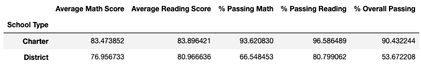

# School_District_Analysis

## Overview of the school district analysis

The purpose of this analysis was to assist our client, Maria, in fixing grades for Thomas High School ninth graders that have been dishonestly altered. We used Python and Pandas to replace the math and reading scores for these students with NaNs so that the analysis for the entire school district will be accurate. We will then compare the results of the fixed analysis with the results of the previously completed analysis for the entire district.

## Results

[Link to PyCity Schools Challenge](https://github.com/SeanDraper/School_District_Analysis/blob/main/PyCitySchools_Challenge.ipynb)

The link above contains the code for the PyCity Schools Challenge.

- How is the district summary affected?

The above image shows the original district summary with the dishonestly altered Thomas High School ninth grade scores.

The above image shows the new district summary with the corrected grades for Thomas High School as NaNs.

The new analysis shows that there is a slight decrease in passing rate for reading, math, and overall when compared to the original analysis. This decrease ranges between .1 to .3%. The reason that the district analysis is effected so little is because of the sample size. We changed a small number of students (9th graders at Thomas High) to NaNs when compared to the thousands of students that are in the entire district.

- How is the school summary affected?

The above image shows the original per school summary with the dishonestly altered Thomas High School ninth grade scores.

The above image shows the new per school summary with the correct grades for Thomas High School.

The only changes in the per school summary were for Thomas High School because those were the only records that were changed. The average reading score went up slightly but the average math along with the passing percentage for reading, math, and overall were slightly lower with the corrected grades.

- How does replacing the ninth graders’ math and reading scores affect Thomas High School’s performance relative to the other schools?

When the ninth grade math and reading scores for Thomas High School are replaced with NaNs the average math grades and passing percentage are lower in comparison to other schools. Average reading score went up slightly. The performance for other schools stays the same because their grades were not altered.

- How does replacing the ninth-grade scores affect the following:

- - Math and reading scores by grade

The above image shows the original math scores by grade with the dishonestly altered Thomas High School ninth grade scores.

The above image shows the new math scores by grade with Thomas High School ninth grade scores as NaN.

The only difference between these scores is that 9th grade for Thomas High School shows as NaN in the new updated version.

The above image shows the original reading scores by grade with the dishonestly altered Thomas High School ninth grade scores.

The above image shows the new reading scores by grade with Thomas High School ninth grade scores as NaN.

As with the math scores, the only difference with between the original and updated version is that 9th grade for Thomas High School is NaN.

- - Scores by school spending

The above image shows the original scores by spending.

The above image shows the new scores by spending with the ninth grade scores for Thomas High School as NaN.

In order to show any change between the original and new scores by spending I had to show dataframes that had several decimal places showing. The formated dataframes that rounded and removed decimal places showed no change. The only spending bin that was changed was $630-644 because that was the bin that Thomas High School fell into. Each of the average and passing % scores were lower in the new version except for average reading score which was slightly higher.

- - Scores by school size

The above image shows the original scores by size.

The above image shows the new scores by size with the ninth grade Thomas High School grades as NaN.

Once again we have to show the comparison between the original and new results without rounding and decimal point formatting or else the results would look the same. The only size that has different results is the medium (1000-2000) school size because that is the bin that Thomas High School falls into. Average reading score is slightly higher but every other result is slightly lower.

- - Scores by school type

The above image shows the original scores by school type.

The above image shows the new scores by school type with the ninth grade Thomas High School grades as NaN.

Again for these results we have to show a comparison without formatting. The only school type that has changed results is charter because Thomas High School is a charter school. Average reading is slightly higher, but every other result is slightly lower.

## Summary

Overall changing Thomas High School ninth grade math and reading scores to NaN had very negligible effects on the overall results. But minor changes were there. First, when you look at the math and reading scores by grade, because all of Thomas High School 9th grade scores were changed, the entire result changed to NaN for both math and reading for Thomas High School 9th grade. Secondly, accross the board when the 9th grade results were changed to NaN there was a slight increase in reading average score but a decrease in math as well as a decrease in the passing percentage in math, reading, and overall. Third, to emphasize how neligible these changes were, if we were to compare the original results for spending, size, and type by using rounded formatting, you would see no change in results. You had to have compared using the original results with several decimal places. Lastly, for the results that were sorted into bins (grade, spending, size, and type) the only bin that was effected was the bin that Thomas High School belonged to.